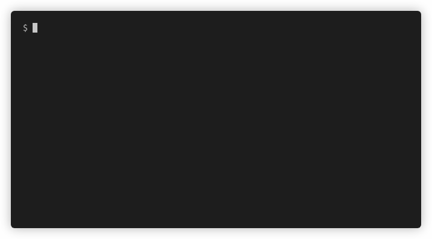

# tago
<p align="center">
  
</p>

`tago` lets you bump [semver](https://semver.org/lang/de/) git tags.

# Features
* detecting and handling semver tags with or without "v"-prefix
* creating initial tag if no tags exist
* interactive user prompting
* automatable using cli params for scripting purposes
* push option

# Installation
```
go get github.com/FalcoSuessgott/tago
```

# Usage
```
tago -h                                        
Interactively bump git tags using SemVer

Usage:
  tago [flags]

Flags:
  -h, --help            help for tago
      --major           bump major version part
      --minor           bump minor version part
  -m, --msg string      tag message
      --patch           bump patch version part
      --prefix          create tag with a leading "v" as tagprefix (e.g v1.1.2)
  -p, --push            pushes new tag to the specified remote
  -r, --remote string   name of the remote (default "origin")
```
# Examples
## bump minor version
```
tago -p --minor -m "minor bump"
```

